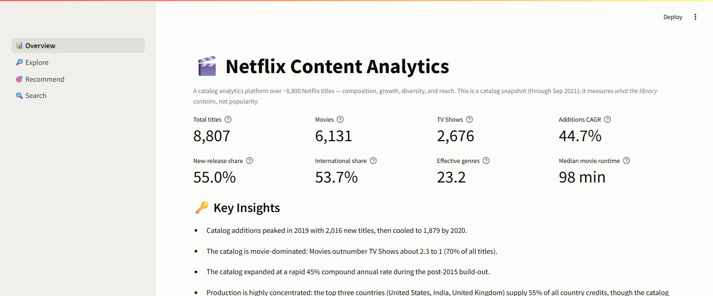
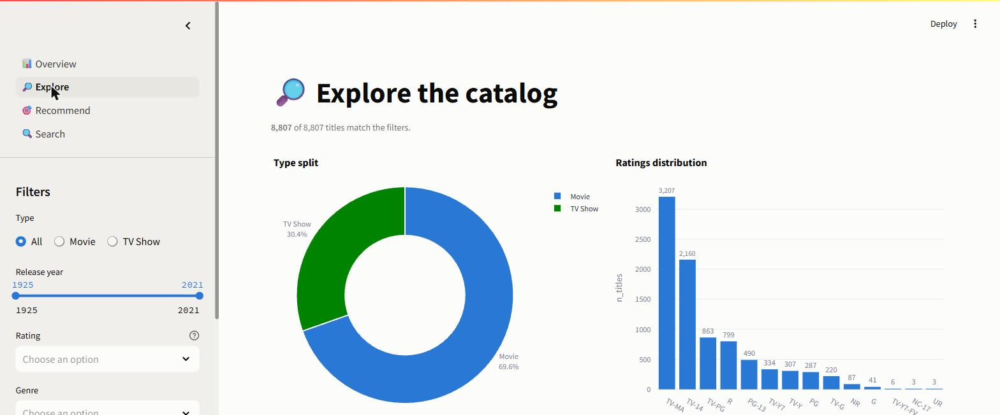
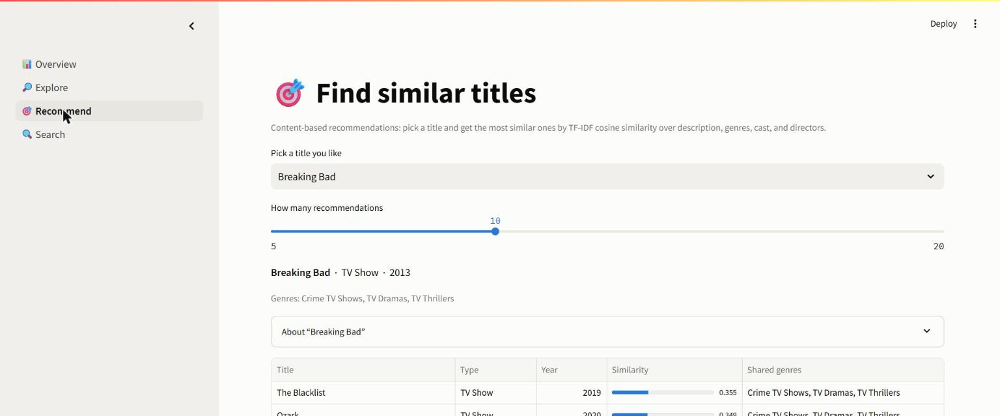

# 🎬 Netflix Content Analytics Platform

> A production-style Business Intelligence platform that analyzes Netflix's
> global content library and turns it into executive-ready insights —
> built with Python, SQL (SQLite), Pandas, Plotly, and Streamlit.

[](https://github.com/Anshkrsingh004/NetflixContentAnalytics/actions/workflows/ci.yml)


[](https://netflixcontentanalytics-hjkbsnkjhx4pnk9bcdam5z.streamlit.app/)

---

## 🚀 Live Demo

### ▶️ **[Launch the live dashboard](https://netflixcontentanalytics-hjkbsnkjhx4pnk9bcdam5z.streamlit.app/)**

Deployed on **Streamlit Community Cloud** — Overview, Explore, Recommend, and
Search, live in your browser. See **[`docs/deployment.md`](docs/deployment.md)**
for how it's deployed; the app self-bootstraps its database on first run, so
there's no data to upload.

---

## 📌 Overview

This project analyzes ~8,800 Netflix titles to answer real business questions:
what kind of content is growing, which countries and genres dominate, how the
catalog has evolved over time, and which titles are similar to one another. It
is designed to look and behave like an internal analytics tool built by a data
team — not a tutorial notebook.

**What it demonstrates:** data engineering, data cleaning, SQL analytics,
exploratory data analysis, KPI design, data visualization, a content-based
recommendation engine, natural-language search, and an interactive dashboard.

> ✅ **Status:** Complete — all 18 milestones built, tested (67 passing), documented,
> and **[deployed live](https://netflixcontentanalytics-hjkbsnkjhx4pnk9bcdam5z.streamlit.app/)**.

---

## ✨ Features

- **📊 Overview dashboard** — headline KPIs (catalog size, growth CAGR, genre
  diversity, international share) plus auto-generated **Key Insights** in plain
  English.
- **🔎 Explore** — filter the catalog by type, release year, rating, genre, and
  country; every chart and the browsable table update live, with CSV export.
- **🎯 Recommend** — content-based "titles similar to X" via TF-IDF + cosine
  similarity, with the shared genres shown for explainability.
- **🔍 Search** — natural-language search ("dark psychological thriller") ranked by
  relevance across each title's text and metadata.
- **🧱 Under the hood** — a normalized SQLite database (3NF), a reusable SQL
  analytics layer, a KPI engine, a themed Plotly chart library, and a 67-test suite.

### 🖼️ Screenshots

**Overview — KPIs & automated insights**



**Explore — live filtering across the catalog**



**Recommend — explainable content-based recommendations**



---

## 📊 Key Insights

A few of the findings the platform surfaces automatically:

- **Movie-dominated catalog** — ~70% Movies to 30% TV Shows (about 2.3 : 1).
- **A post-2015 build-out** — additions grew at a **~45% CAGR** from 2016, peaking
  in **2019** (2,016 titles) before cooling.
- **Fresh over back-catalog** — **55%** of titles were added within a year of
  release.
- **Genuinely global** — **~54%** of titles are produced outside the US, spanning
  **122 countries**; the US, India, and the UK lead.
- **Adult-skewing** — TV-MA and TV-14 together are roughly **60%** of ratings.

> Generated by the KPI engine (M8) and the automated insight generator (M12) —
> not hand-written.

---

## 🧰 Tech Stack

| Layer            | Tools                                             |
|------------------|---------------------------------------------------|
| Language         | Python 3.12, SQL                                  |
| Data wrangling   | Pandas, NumPy                                      |
| Database         | SQLite (`sqlite3` standard library)               |
| Visualization    | Plotly, Matplotlib                                |
| Dashboard        | Streamlit                                          |
| ML / NLP         | scikit-learn (TF-IDF + cosine similarity)         |
| Tooling          | Jupyter, pytest, Git/GitHub, VS Code              |

---

## 🏗️ Architecture

The platform is a **layered pipeline** — raw CSV → cleaning → normalized SQLite →
analytics / ML → dashboard — where each layer exposes reusable objects (DataFrames,
figures, typed values) to the one above, and each computed value has a single
source of truth. See **[`docs/architecture.md`](docs/architecture.md)** for the
full data-flow diagram and design principles.

---

## 📁 Project Structure

```
NetflixContentAnalytics/
├── data/
│   ├── raw/            # Original dataset (netflix_titles.csv)
│   ├── processed/      # Cleaned dataset (generated)
│   └── database/       # SQLite database (generated)
├── notebooks/          # eda.ipynb — exploratory analysis narrative
├── sql/
│   ├── schema.sql      # Normalized 3NF schema
│   └── analytics/      # Reusable analytical SQL queries
├── src/
│   ├── config.py       # Central paths & constants (single source of truth)
│   ├── logger.py       # Reusable logging setup
│   ├── cleaning/       # Data-cleaning pipeline (steps + validation)
│   ├── database/       # Schema connection + ETL loader
│   ├── analysis/       # Profiling, quality, SQL analytics, EDA, KPIs, insights
│   ├── visualization/  # Themed Plotly chart library
│   ├── recommender/    # TF-IDF content-based recommender
│   ├── search/         # TF-IDF natural-language search
│   └── dashboard/      # Streamlit app (app / data / views)
├── reports/            # Generated reports, figures, and the viz gallery
├── docs/               # Data dictionary, database & architecture docs
├── tests/              # pytest suite (67 tests)
├── assets/             # Screenshots and static files
├── .streamlit/         # Dashboard theme
├── requirements.txt
└── README.md
```

---

## 🚀 Getting Started

### 1. Clone the repository
```bash
git clone <your-repo-url>
cd NetflixContentAnalytics
```

### 2. Create and activate a virtual environment

**Windows (PowerShell):**
```powershell
python -m venv .venv
.\.venv\Scripts\Activate.ps1
```

**macOS / Linux:**
```bash
python -m venv .venv
source .venv/bin/activate
```

### 3. Install dependencies
```bash
pip install -r requirements-dev.txt    # full dev stack (app + notebooks + tests)
```
The deployed app installs only the lean **`requirements.txt`** (runtime deps);
`requirements-dev.txt` is a superset that adds matplotlib, Jupyter, and pytest for
local development.

### 4. Verify the setup
```bash
python -m src.config     # prints resolved paths and confirms the dataset exists
python -m src.logger     # writes a test line to logs/netflix_analytics.log
```

### 5. Launch the dashboard
```bash
streamlit run src/dashboard/app.py
```
The app self-bootstraps: on first run it builds the cleaned dataset and the SQLite
database from the raw CSV if they don't exist yet, then opens the interactive
dashboard (Overview, Explore, Recommend, Search).

### 6. Run the tests
```bash
pytest
```
A 67-test suite (unit + integration) covering the cleaning pipeline, quality/KPI
scoring, the SQL analytics, the recommender, and search.

---

## 🗺️ Roadmap

The platform is built in milestones. Completed items are checked off.

- [x] **M1 — Project Setup & Environment**
- [x] **M2 — Data Acquisition & Understanding**
- [x] **M3 — Data Cleaning Pipeline**
- [x] **M4 — Data Quality Report**
- [x] **M5 — Database Design & ETL**
- [x] **M6 — SQL Analytics Layer**
- [x] **M7 — Exploratory Data Analysis**
- [x] **M8 — KPI & Metrics Engine**
- [x] **M9 — Visualization Library**
- [x] **M10 — Recommendation Engine**
- [x] **M11 — Natural Language Search**
- [x] **M12 — Automated Insight Generation**
- [x] **M13 — Streamlit Dashboard (Core)**
- [x] **M14 — Advanced Dashboard Features**
- [x] **M15 — Testing**
- [x] **M16 — Documentation**
- [x] **M17 — Deployment**
- [x] **M18 — Interview Prep & Portfolio Polish**

---

## 📊 Data Source

*Netflix Movies and TV Shows* dataset (`netflix_titles.csv`) — publicly
available on Kaggle. Columns: `show_id, type, title, director, cast, country,
date_added, release_year, rating, duration, listed_in, description`.

---

## 📄 License

Released under the MIT License — see [`LICENSE`](LICENSE).

---

## 🙌 Contributing

See [`CONTRIBUTING.md`](CONTRIBUTING.md) for setup, project conventions, and how to
run the tests.
