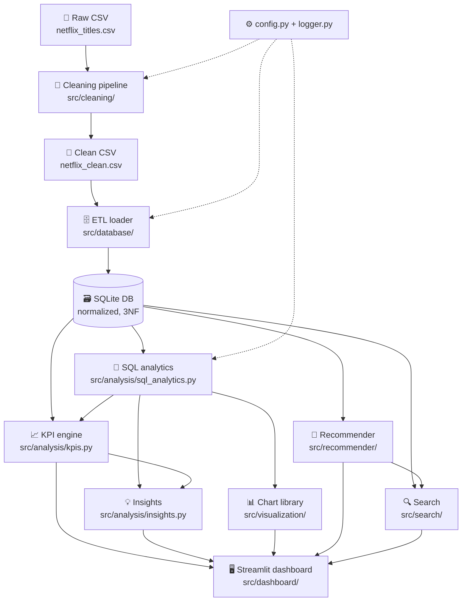

# Architecture

The platform is built as a **layered pipeline**: each layer consumes the one below
it and exposes clean, reusable objects (DataFrames, figures, typed values) to the
one above. Nothing skips a layer, and each computed value has a single source of
truth. This is what makes the top of the stack — the dashboard — mostly *wiring*.

## Data flow

## Layers

| Layer | Module(s) | Responsibility | Milestone |
|-------|-----------|----------------|-----------|
| **Foundation** | `config.py`, `logger.py` | Central paths/constants; reusable logging | M1 |
| **Understanding** | `analysis/profiling.py` | Profile the raw data; data dictionary | M2 |
| **Cleaning** | `cleaning/` | Pure, validated transformation steps → clean CSV | M3 |
| **Quality** | `analysis/quality.py` | Score data quality (raw vs. clean) | M4 |
| **Storage** | `sql/schema.sql`, `database/` | Normalized 3NF schema + idempotent ETL | M5 |
| **Analytics** | `analysis/sql_analytics.py` | Reusable analytical SQL queries | M6 |
| **EDA** | `analysis/eda.py`, `notebooks/` | Distributions, trends, outliers, correlations | M7 |
| **Metrics** | `analysis/kpis.py` | Headline KPIs as typed values | M8 |
| **Visualization** | `visualization/` | Themed, reusable Plotly chart builders | M9 |
| **Recommender** | `recommender/` | TF-IDF + cosine content-based recommendations | M10 |
| **Search** | `search/` | TF-IDF vector-space natural-language search | M11 |
| **Insights** | `analysis/insights.py` | Ranked, template-based NL insight generation | M12 |
| **Product** | `dashboard/` | Streamlit app composing everything above | M13–M14 |
| **Tests** | `tests/` | Unit + integration suite | M15 |

## Design principles

- **Single source of truth.** Paths live only in `config.py`; each KPI is defined
  once in the KPI engine; the corpus loader is shared by the recommender and search.
  No value is computed two different ways.
- **Pure, composable functions.** Cleaning and analysis steps take a value and
  return a new one without mutating the input, so they're independently testable
  and reorderable.
- **Build on the layer below.** The insight generator narrates the KPI engine and
  SQL layer; the dashboard composes the chart/KPI/model layers. Higher layers never
  re-derive lower-layer results.
- **Reproducible & self-bootstrapping.** Generated artifacts (clean CSV, SQLite DB)
  are rebuilt deterministically from the committed raw CSV, so a fresh clone — or a
  cloud deploy — works with no manual steps.
- **Right tool per medium.** Static matplotlib for reports and notebooks;
  interactive Plotly for the dashboard — both driven by one validated,
  colorblind-safe palette so everything reads as a single system.

## The dashboard's three sub-layers

Within `src/dashboard/`, the same separation-of-concerns discipline applies:

- **`data.py`** — the cached access layer (`@st.cache_data` for query/metric
  results, `@st.cache_resource` for the fitted models). The only place that opens a
  DB connection or fits a model.
- **`views.py`** — one render function per page; pulls cached data and composes it
  with the chart library. No business logic.
- **`app.py`** — page config and navigation only.
