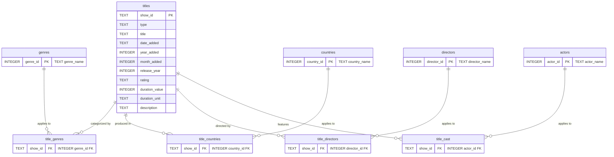

# 🗄️ Database Design — Netflix Content Analytics

**Engine:** SQLite (file-based, serverless, ships with Python)
**Schema DDL:** [`sql/schema.sql`](../sql/schema.sql)
**Loader (ETL):** [`src/database/loader.py`](../src/database/loader.py)
**Grain:** one row per Netflix title in `titles`

---

## Why normalize at all?

The raw dataset packs multiple values into single cells — `cast`, `country`,
`director`, and `listed_in` are comma-separated lists. That violates **First
Normal Form (1NF)** and makes questions like *"how many titles per country?"*
or *"which directors made the most titles?"* impossible to answer with clean
`GROUP BY`s. Normalizing into dimension + bridge tables resolves the
many-to-many relationships and reaches **Third Normal Form (3NF)**: every
non-key attribute depends on the key, and there are no repeating groups.

---

## Entity-Relationship Diagram

---

## Table-by-Table: why each one exists

| Table | Type | Why it exists |
|-------|------|---------------|
| `titles` | Entity | The core fact of the model — one row per show, holding every single-valued attribute (type, title, dates, rating, duration, description). Its `show_id` is the primary key every bridge points back to. |
| `genres` | Dimension | The 42 distinct genres, deduplicated once so a genre name is stored a single time and referenced by id. |
| `countries` | Dimension | 123 distinct production countries (incl. `"Unknown"`). Enables per-country aggregation and the choropleth map (M14). |
| `directors` | Dimension | 4,994 distinct directors. Lets us rank directors by output without scanning comma-strings. |
| `actors` | Dimension | 36,440 distinct actors — the highest-cardinality attribute, and the clearest case for normalization. |
| `title_genres` | Bridge (M:N) | Links titles ↔ genres. A title has many genres; a genre has many titles. |
| `title_countries` | Bridge (M:N) | Links titles ↔ countries. |
| `title_directors` | Bridge (M:N) | Links titles ↔ directors. |
| `title_cast` | Bridge (M:N) | Links titles ↔ actors (64,949 links). |

Each bridge uses a **composite primary key** `(show_id, <dim>_id)`, which both
enforces uniqueness of a link and, as a nice side effect, deduplicates dirty
source data — e.g. title `s3719` listed its director *twice*
(`"Miguel Cohan, Miguel Cohan"`); the PK collapsed it to one link automatically.

---

## Indexes and why they were chosen

| Index | Purpose |
|-------|---------|
| `idx_titles_type`, `idx_titles_release_year`, `idx_titles_year_added` | Speed up the dashboard's most common filters. |
| `idx_title_genres_genre`, `idx_title_countries_country`, `idx_title_directors_director`, `idx_title_cast_actor` | Speed up joins *from* a dimension. The `show_id` side of each bridge is already covered by its composite primary key, so only the dimension-id side needs an explicit index. |

`UNIQUE` constraints on every `*_name` column prevent duplicate dimension rows
and are themselves backed by an index.

---

## Design decisions & trade-offs

- **`type` and `rating` are kept as columns on `titles`**, not separate lookup
  tables. They are single-valued, low-cardinality attributes; a lookup table
  would add joins for little benefit. (A `ratings` dimension would be justified
  if we needed rating metadata like an age floor.)
- **`primary_country` / `primary_genre` are *not* stored in the database.** They
  were convenience helpers in the flat CSV; the normalized bridges supersede
  them, so duplicating them would risk inconsistency.
- **Foreign keys are enforced** (`PRAGMA foreign_keys = ON` per connection) with
  `ON DELETE CASCADE`, so deleting a title cleanly removes its links.
- **The schema is idempotent** (`DROP ... IF EXISTS` first), so the loader can
  rebuild the database deterministically on every run.
- **`date_added` is stored as ISO text** (`YYYY-MM-DD`) — SQLite has no native
  date type, and ISO strings sort and compare correctly.
