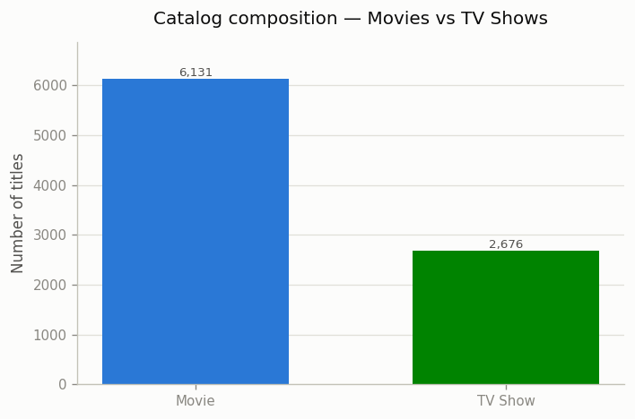
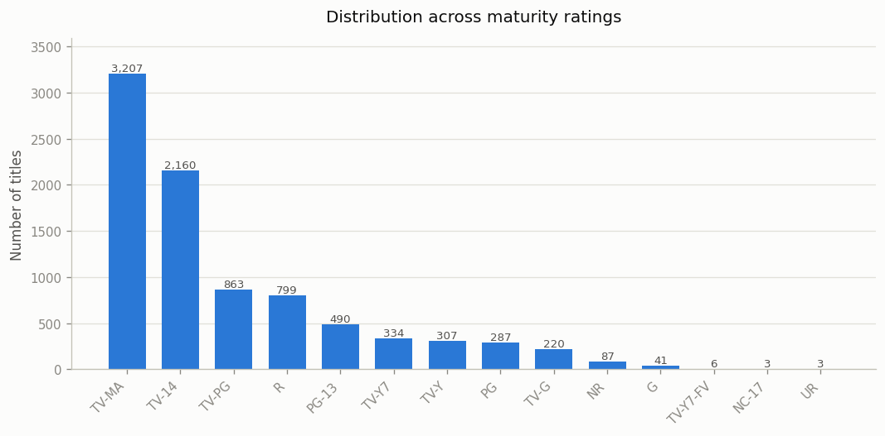
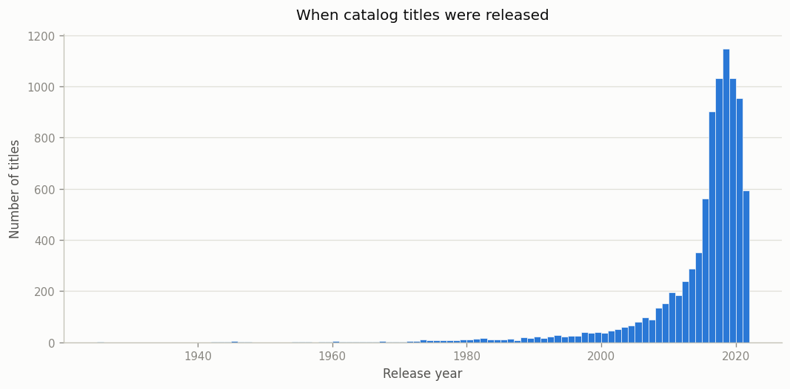
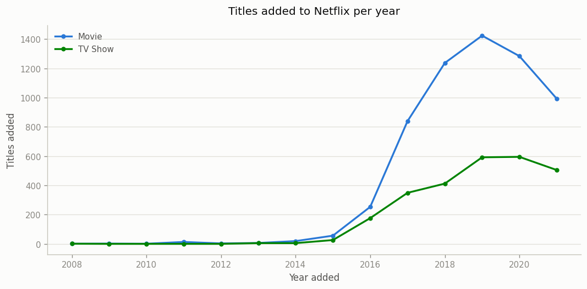
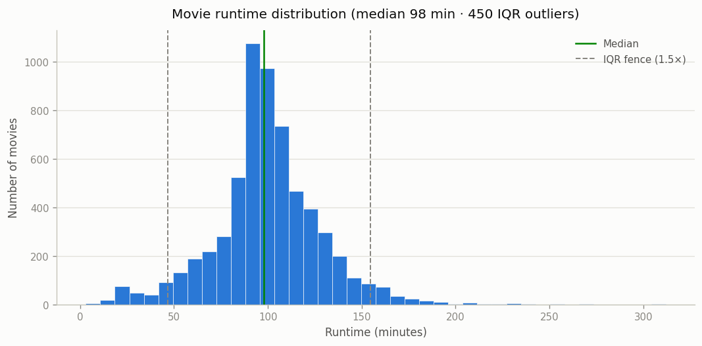
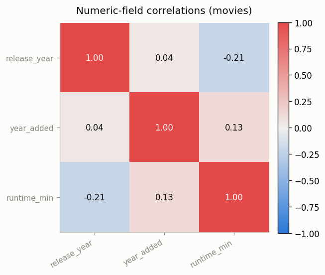

# 🔍 Exploratory Data Analysis — Netflix Catalog

- **Generated:** 2026-08-03 13:10:17
- **Source:** `data/database/netflix.db` (normalized SQLite DB, Milestone 5)
- **Grain:** one row per title — 8,807 titles (6,131 Movies, 2,676 TV Shows)

> Auto-generated by `src/analysis/eda.py`. Distributions and outliers are computed in pandas on the `titles` table; the ranking charts reuse the Milestone 6 SQL analytics layer. See `notebooks/eda.ipynb` for the narrative walk-through.

## 1. Catalog Composition

- The catalog is **69.6% Movies / 30.4% TV Shows** — movie-heavy, but TV has grown fastest in recent years (see §3).

- Ratings are dominated by mature audiences: **TV-MA** and **TV-14** together account for roughly 6 in 10 titles.

## 2. Content Age

- Release years are **heavily left-skewed**: the vast majority of titles are from the 2010s onward, with a long thin tail of older classics.

## 3. Growth Over Time

- Additions accelerated sharply after 2015 and **peaked in 2019**. TV Show additions climb faster than Movies late in the series, narrowing the gap.

## 4. Movie Runtime & Outliers

- Movie runtimes center on a **median of 98 minutes** (IQR 87–114). Using the 1.5×IQR rule, **450 of 6,131 movies** fall outside the fence [46, 154] min — from 3-min shorts to a 312-min extreme.

## 5. Numeric Relationships

**Correlation matrix (movies only):**

|  | release_year | year_added | runtime_min |
| --- | --- | --- | --- |
| release_year | 1.00 | 0.04 | -0.21 |
| year_added | 0.04 | 1.00 | 0.13 |
| runtime_min | -0.21 | 0.13 | 1.00 |

- The catalog is **overwhelmingly categorical** — only three numeric fields exist. Correlations are weak: newer movies trend very slightly shorter, but there is no strong linear relationship to exploit. This is itself a finding — insight here comes from the categorical dimensions (genre, country, type), not numeric regression.

## 6. Numeric Summary

|  | count | mean | std | min | 25% | 50% | 75% | max |
| --- | --- | --- | --- | --- | --- | --- | --- | --- |
| release_year | 8,807.00 | 2,014.18 | 8.82 | 1,925.00 | 2,013.00 | 2,017.00 | 2,019.00 | 2,021.00 |
| year_added | 8,797.00 | 2,018.87 | 1.57 | 2,008.00 | 2,018.00 | 2,019.00 | 2,020.00 | 2,021.00 |
| duration_value | 8,807.00 | 69.85 | 50.81 | 1.00 | 2.00 | 88.00 | 106.00 | 312.00 |
